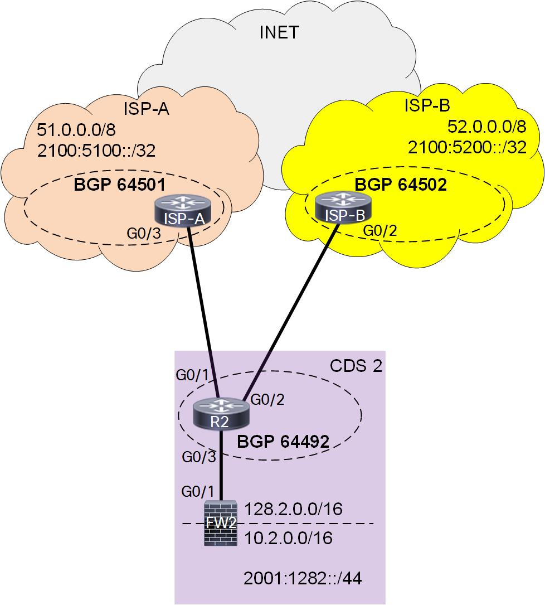
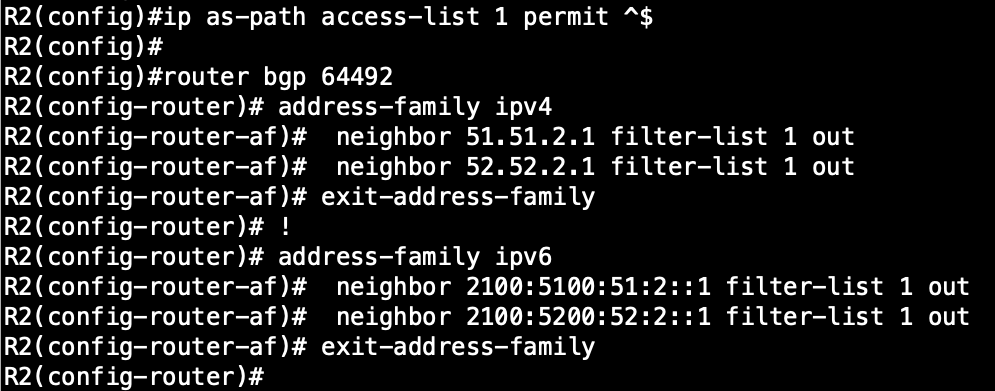
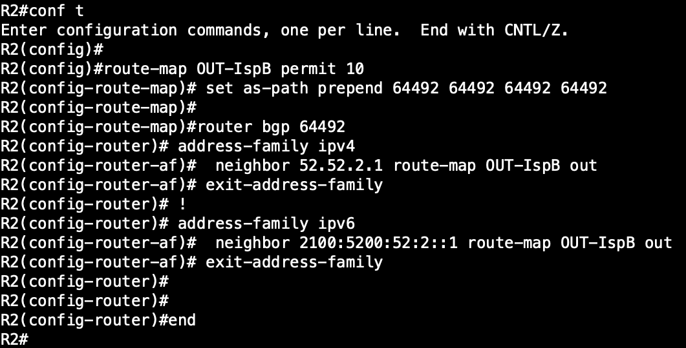
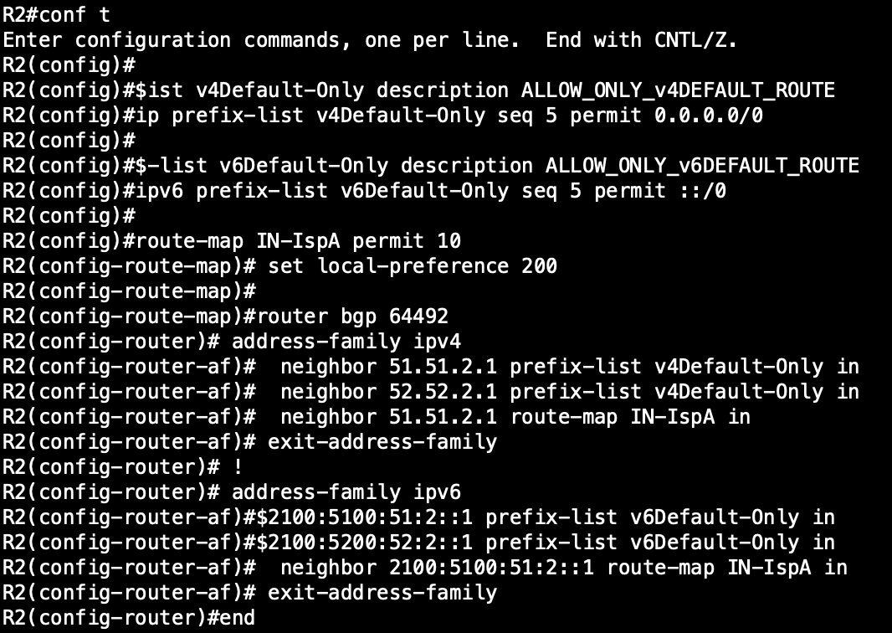
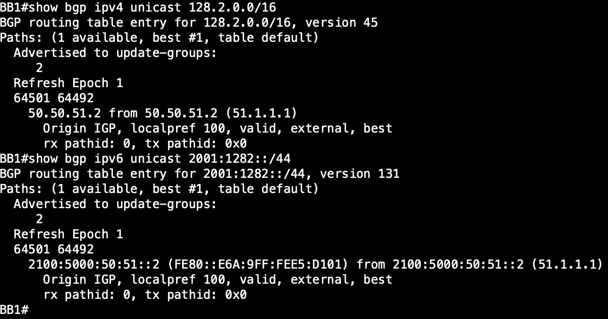
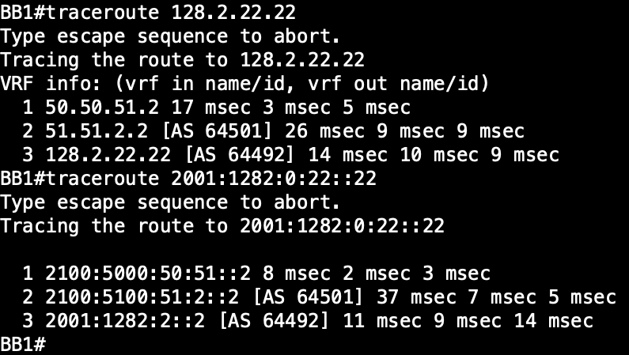
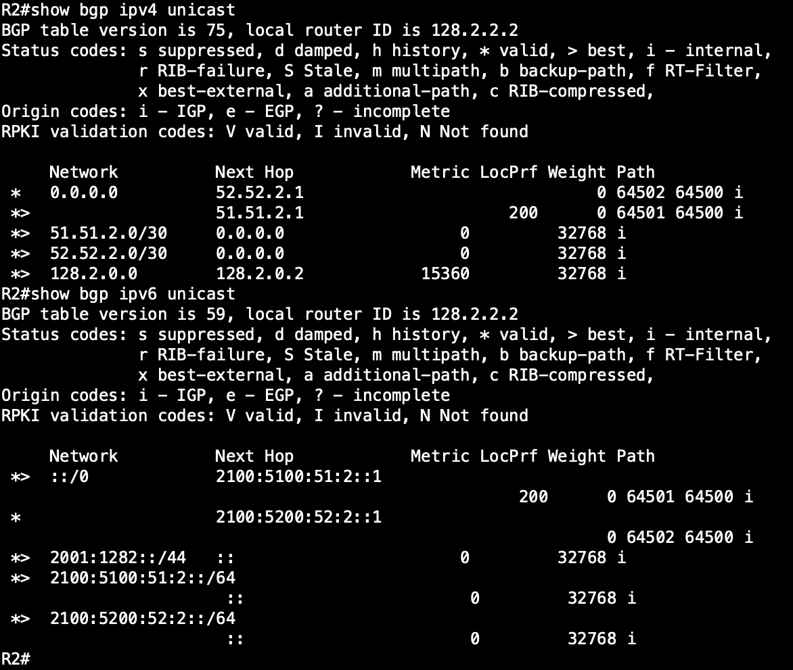

# CDS-2 Instructions

## My Contact information:
> Email:    michael.zsiga@gmail.com\
> Twitter:  https://twitter.com/michael_zsiga \
> LinkedIn: https://www.linkedin.com/in/zigzag \
> Website:  https://zigbits.tech

This is Common Deployment Scenario (CDS) # 2 from the Cisco Live presentation BRKRST-2044 - Enterprise Multi-Homed Internet Edge Architectures. CDS-2 highlights the single router, dual ISP connections deployment example. Within this page are the steps to properly configure BGP Active / Standby (Section 1) and BGP Active / Active (Section 2) routing connectivity to the Internet (INET).

NOTE: For all the Common Deployment Scenarios (CDS) you can load the initial configurations for BB1, BB2, ISP-A, and ISP-B once. We are not making a lot of changes to these devices, if any.

# CDS-2 Reference topology
Here is the CDS-2 Reference topology



When we have dual IPS links we really need to know what we are using our links for and what we are honestly trying to solve.  We can solve for high-availability (HA) which is Active / Standby or we can solve for congestion and HA which is Active / Active.  In addition to this, we also need address how we handle equal and unequal bandwidths from an ISP perspective.

# CDS-2 Section 1: BGP Active / Standby

Here we are going to show how to properly create a BGP Active / Standby policy.  The first task we need to complete is to identify what our policies are going to be.  You can feel free to tweak these policies but for this section we are going to do the following:

Ingress Policy: We are going to use ISP A for all incoming traffic. If ISP-A fails, we will leverage ISP-B for full failover. Now what tool do you think we are going to use to help us achieve this policy?? We are going to use BGP AS-Path Prepend

Egress Policy: We are going to use ISP A for all outgoing traffic.  If ISP-A fails, we will leverage ISP-B for full failover. From a BGP Tool perspective, we are going to use Local-Preference to make this policy happen.

NOTE: Before moving forward, make sure you have the initial configurations loaded for FW2, R2, BB1, BB2, ISP-A, and ISP-B. Remember, we are not making a ton of changes on BB1, BB2, ISP-A, or ISP-B, so if you have already loaded them you should be good to go.

The initial configurations of FW2 and R2 include the IGP configuration between the two devices along with the basic BGP configuration on R2 to bring up its BGP Neighbors ISP-A and ISP-B.  No BGP policies have been applied, though there are some pre-configured route-maps and prefix-lists that we will be using.

Below is the starting BGP configuration on R2. You can check the running configuration of the devices to view the starting EIGRP configuration, we are not going to show that here to reduce the length of this section.

```
router bgp 64492
 no bgp log-neighbor-changes
 no bgp default ipv4-unicast
 neighbor 2100:5100:51:2::1 remote-as 64501
 neighbor 2100:5100:51:2::1 description IPv6_eBGP_PEER_TO_ISP-A
 neighbor 2100:5200:52:2::1 remote-as 64502
 neighbor 2100:5200:52:2::1 description IPv6_eBGP_PEER_TO_ISP-B
 neighbor 51.51.2.1 remote-as 64501
 neighbor 51.51.2.1 description IPv4_eBGP_PEER_TO_ISP-A
 neighbor 52.52.2.1 remote-as 64502
 neighbor 52.52.2.1 description IPv4_eBGP_PEER_TO_ISP-B
 !
 address-family ipv4
  network 51.51.2.0 mask 255.255.255.252
  network 52.52.2.0 mask 255.255.255.252
  network 128.2.0.0
  neighbor 51.51.2.1 activate
  neighbor 51.51.2.1 soft-reconfiguration inbound
  neighbor 52.52.2.1 activate
  neighbor 52.52.2.1 soft-reconfiguration inbound
 exit-address-family
 !
 address-family ipv6
  network 2001:1282::/44
  network 2100:5100:51:2::/64
  network 2100:5200:52:2::/64
  neighbor 2100:5100:51:2::1 activate
  neighbor 2100:5100:51:2::1 soft-reconfiguration inbound
  neighbor 2100:5200:52:2::1 activate
  neighbor 2100:5200:52:2::1 soft-reconfiguration inbound
 exit-address-family

ipv6 route 2001:1282::/44 Null0
```

## Safety First

When we have dual links like we do in this CDS, and all of the rest of them, we need to make sure we are not re-advertising networks that we do not own out to our other ISP Peer.  If we were to do this, we could end up becoming an unintentional transport provider. This honestly happens a lot so do not skip this step.

The easiest way to make sure this doesn't happen to you is to use an as-path access-list to filter the outbound advertisements so that you are only advertising your Enterprises Prefixes.  Whats cool about an as-path access list is that you can use it for both IPv4 and IPv6.  To create the as-path access list we need to understand BGP regular expressions a little.  We also need to understand when and how our own ASN is added to the AS-PATH of our Enterprise routes.

Our local AS number is added after processing the AS-PATH list, so we can match on an empty AS PATH.

Now from a regular expression to match an empty path we need to match the beginning of the path, the end of the path, and nothing else. The (^) matches the beginning of the path. The ($) matches the end of the path.  When we put it together this is what we get.

```
ip as-path access-list 1 permit ^$
```

To apply this as-path access-list we just add it to the BGP neighbor configuration with the filter-list option, and now we are safe!

```
router bgp 64492
 address-family ipv4
  neighbor 51.51.2.1 filter-list 1 out
  neighbor 52.52.2.1 filter-list 1 out
 exit-address-family
 !
 address-family ipv6
  neighbor 2100:5100:51:2::1 filter-list 1 out
  neighbor 2100:5200:52:2::1 filter-list 1 out
 exit-address-family
```

Here is a screenshot of this being configured on R2:



## Ingress policy

To enforce Ingress traffic over ISP-A, we need to prepend our AS-PATH out to ISP-B.  Remember BGP prefers the shortest AS-PATH. How many times should you prepend your ASN? Its usually good to prepend 4 or less times.  When you start to prepend more than that it can be obnoxious. If you have business reason to prepend more than do it. There are some designs out there in the wild that have a higher number of prepends.

To achieve this AS-PATH prepend we can create a simple route-map on R2 and apply it to our ISP-A BGP Neighbor.

```
route-map OUT-IspB permit 10
 set as-path prepend 64492 64492 64492 64492

router bgp 64492
 address-family ipv4
  neighbor 52.52.2.1 route-map OUT-IspB out
 exit-address-family
 !
 address-family ipv6
  neighbor 2100:5200:52:2::1 route-map OUT-IspB out
 exit-address-family
```

Here is a screenshot of the ingress policy being created and applied.



## Egress policy

For our egress policy, we do not need the full internet table, so we can start by filtering the routes coming from both ISP-A and ISP-B to just the defaults.  Then to enforce Egress traffic over ISP-A, we need to prefer the default routes being used from ISP-A over the ISP-B default routes. To do this we use local-preference.  Here is how this looks:

```
ip prefix-list v4Default-Only description ALLOW_ONLY_v4DEFAULT_ROUTE
ip prefix-list v4Default-Only seq 5 permit 0.0.0.0/0

ipv6 prefix-list v6Default-Only description ALLOW_ONLY_v6DEFAULT_ROUTE
ipv6 prefix-list v6Default-Only seq 5 permit ::/0

route-map IN-IspA permit 10
 set local-preference 200

router bgp 64492
 address-family ipv4
  neighbor 51.51.2.1 prefix-list v4Default-Only in
  neighbor 52.52.2.1 prefix-list v4Default-Only in
  neighbor 51.51.2.1 route-map IN-IspA in
 exit-address-family
 !
 address-family ipv6
  neighbor 2100:5100:51:2::1 prefix-list v6Default-Only in
  neighbor 2100:5200:52:2::1 prefix-list v6Default-Only in
  neighbor 2100:5100:51:2::1 route-map IN-IspA in
 exit-address-family
```

Here is a screenshot of the egress policy being created and applied.



## Verification

To verify our ingress policy we need to check a remote server such as a BGP looking glass or route server on the internet. In this lab environment this role is performed by BB1 and/or BB2.

On BB1 we will check to see how the internet see's CDS-2's prefixes 128.2.0.0/16 and 2001:1282::/44 and make sure its being preferred through ISP-A's ASN 64501.

```
show bgp ipv4 unicast 128.2.0.0/16
show bgp ipv6 unicast 2001:1282::/44
```

Here is a screenshot of the Ingress policy being verified.





As you can see in the screenshots above, ISP-A is being selected to CDS-2's networks as we have configured.  

Now lets verify our egress policy.  To do this we just check the local BGP table on R2 with the following commands.

```
show bgp ipv4 unicast
show bgp ipv6 unicast
```

Here is a screenshot to show the output of these commands on R2.


