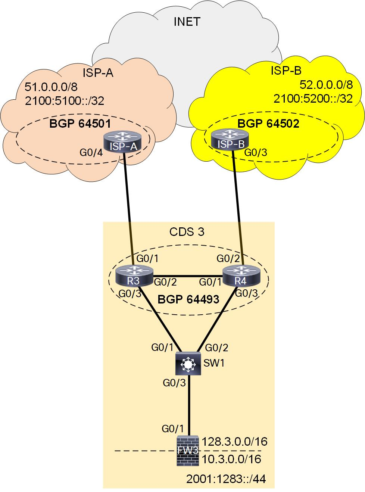
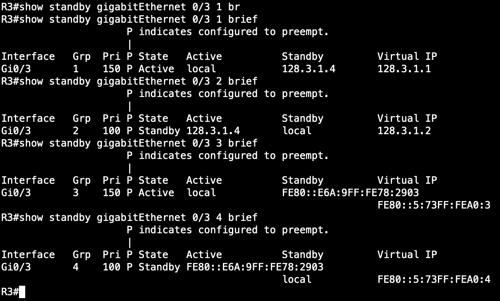
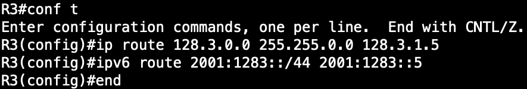
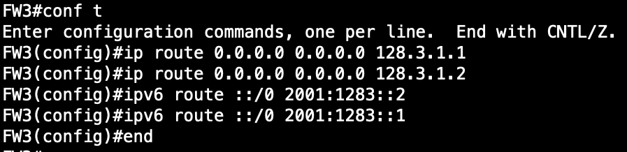
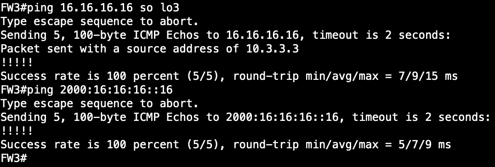

# CDS-3 Instructions

My Contact information:
> Email:    michael.zsiga@gmail.com\
> Twitter:  https://twitter.com/michael_zsiga \
> LinkedIn: https://www.linkedin.com/in/zigzag \
> Website:  https://zigbits.tech

This is Common Deployment Scenario (CDS) # 3 from the Cisco Live presentation BRKRST-2044 - Enterprise Multi-Homed Internet Edge Architectures. CDS-3 highlights the dual router, dual ISP connections deployment example. Within this page are the steps to properly configure BGP Active / Active routing connectivity to the Internet (INET).  There are three option we are going to cover:

- Option 1 - Firewall and FHRP (Section 1)
- Option 2 - ECMP on Firewall (Section 2)
- Option 3 - Intermediate ECMP on L3 Switch (Section 3)

NOTE: For all the Common Deployment Scenarios (CDS) you can load the initial configurations for BB1, BB2, ISP-A, and ISP-B once. We are not making a lot of changes to these devices, if any.

# CDS-3 Reference topology
Here is the CDS-3 Reference topology



NOTE: Make sure you have the initial configurations loaded for R3, R4, SW1, and FW3 before starting each section below.

# CDS-3 Section 1: Firewall and First Hop Redundancy Protocol

For our policy in this CDS, we are going to build an Active / Active configuration.  The Edge Routers R3 and R4 already have BGP configured and their corresponding ISP connections are running.  There are no policies applied to these ISP connections.  For this section, our edge routers are going to be running Hot Standby Router Protocol (HSRP) for both IPv4 and IPv6. SW1 is going to be acting as a layer 2 switch (think of a stackable switch). Our firewall, FW3, will be utilizing static tragic default routes to the two different HSRP Groups we are going to configure.

Our first task here is to configure our shared subnet between R3, R4, SW1, and FW3.  For this section, our shared subnet will be 128.3.1.0/24 and 2001:1283::/64 for IPv4 and IPv6 respectively.  Here is the breakdown of what each IP address will be used for:

- 128.3.1.0/24
  - 128.3.1.1/24 - HSRP Group 1 VIP address
  - 128.3.1.2/24 - HSRP Group 2 VIP address
  - 128.3.1.3/24 - R3's internal
  - 128.3.1.4/24 - R4's internal
  - 128.3.1.5/24 - FW3's outside addresses    

- 2001:1283::/64
  - 2001:1283::1/64 - HSRP Group 1 VIP address
  - 2001:1283::2/64 - HSRP Group 2 VIP address
  - 2001:1283::3/64 - R3's internal
  - 2001:1283::4/64 - R4's internal
  - 2001:1283::5/64 - FW3's internal


```
R3:
interface GigabitEthernet0/3
 description CONN_TO_SW1
 ip address 128.3.1.3 255.255.255.0
 ipv6 address 2001:1283::3/64

R4:
interface GigabitEthernet0/3
 description CONN_TO_SW1
 ip address 128.3.1.4 255.255.255.0
 ipv6 address 2001:1283::4/64

FW3:
interface GigabitEthernet0/1
 description CONN_TO_SW1
 ip address 128.3.1.5 255.255.255.0
 ipv6 address 2001:1283::5/64

SW1:
vlan 100
 name CDS-3

interface range g0/1-3
 switchport mode access
 switchport access vlan 100

```

Now that we have our little network configured here, we need to configure HSRP.  Here is how we are going to configure HSRP with four groups (two per address family) on both R3 and R4.

```
R3:
interface GigabitEthernet0/3
 standby version 2
 standby 1 ip 128.3.1.1
 standby 1 priority 150
 standby 1 preempt
 standby 2 ip 128.3.1.2
 standby 2 preempt
 standby 3 ipv6 2001:1283::1/64
 standby 3 priority 150
 standby 3 preempt
 standby 4 ipv6 2001:1283::2/64
 standby 4 preempt

 R4:
 interface GigabitEthernet0/3
  standby version 2
  standby 1 ip 128.3.1.1
  standby 1 preempt
  standby 2 ip 128.3.1.2
  standby 2 priority 150
  standby 2 preempt
  standby 3 ipv6 2001:1283::1/64
  standby 3 preempt
  standby 4 ipv6 2001:1283::2/64
  standby 4 priority 150
  standby 4 preempt

```

With HSRP configured, we are going to use the show command "show standby" to verify our configuration:

```
show standby gigabitEthernet 0/3 1 brief
show standby gigabitEthernet 0/3 2 brief
show standby gigabitEthernet 0/3 3 brief
show standby gigabitEthernet 0/3 4 brief
```

Here is a screenshot of these show commands on R3:



Configure static routes on each edge router, R3 and R4, pointing back to FW4.

```
ip route 128.3.0.0 255.255.0.0 128.3.1.5
ipv6 route 2001:1283::/44 2001:1283::5
```



Now, because we do not have administrative control over the firewall in this situation, we need to have our security team add the corresponding default static tragic routes on their firewall pointing to the HSRP VIP addresses.  Here is what you should configure on FW3.

```
ip route 0.0.0.0 0.0.0.0 128.3.1.1
ip route 0.0.0.0 0.0.0.0 128.3.1.2
ipv6 route ::/0 2001:1283::2
ipv6 route ::/0 2001:1283::1
```




## Verification

For our verification in this section, we are going to leverage ping to make sure our connectivity is good to go.  From our FW3 we are going to ping the external addresses 16.16.16.16 and 2000:16:16:16::16. For IPv4 we are going to source our pings from Loopback3 because we are NATing on our Firewall. Then from BB1 we are going to ping our own addresses of 128.3.33.33 and 2001:1283:0:33::33.

```
ping 16.16.16.16 so lo3
ping 2000:16:16:16::16

ping 128.3.33.33
ping 2001:1283:0:33::33
```
Below are screenshots showing our successful verification for our Egress and Ingress connectivity.




# CDS-3 Section 2: Equal-Cost Multipath (ECMP) on Firewall

- Configure IP Addresses between Edge Routers and Firewall
- Configure IGP between edge routers and FW
- inject Default route from BGP into IGP on edge Routers
- inject summary / routes for CDS-3's networks from IGP into BGP on edge Routers
- Verify connectivity


# CDS-3 Section 3: Intermediate Equal-Cost Multipath (ECMP) on L3 Switch

- Configure IP address between edge routers, FW, and Switch
    - 128.3.0.0/30: SW1 - R3
    - 128.3.0.8/30: SW1 - R4
    - 128.3.0.12/30: SW1 - FW3

    - 2001:1283:3::/64 R3 - SW1
    - 2001:1283:4::/64 R4 - SW1
    - 2001:1283:5::/64 SW1 - FW3

 - Configure IGP between Edge Routers and SW
 - Inject Default routes from BGP into IGP
 - Make sure FW has a default route out to the SW
 - Add Static routes on SW1, redistribute them into IGP

 - Verify Connectivity
