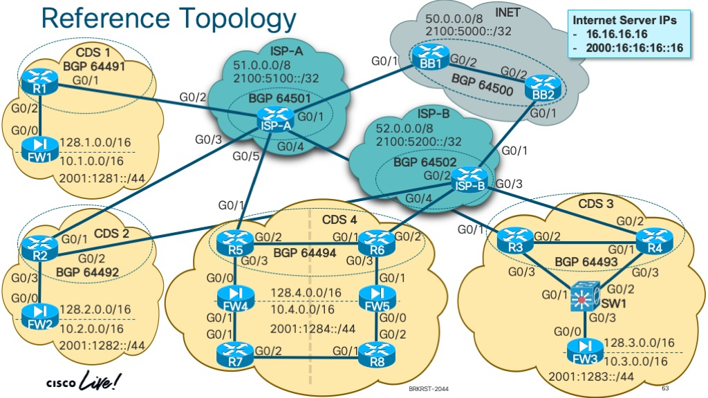

# Enterprise Multi-Homed Internet Edge Architectures (BRKRST-2044)
Welcome to the Github repository for the lab demonstration!

> Contact information:\
> Email:    michael.zsiga@gmail.com\
> Twitter:  https://twitter.com/zig_zsiga \
> LinkedIn: https://www.linkedin.com/in/zigzag \
> Website:  https://zigbits.tech

## Reference topology
Please reference this diagram when reviewing this Cisco Live session.

## CDS 1
This folder contains the instructions and steps for Common Deployment Scenario 1: One Router with One ISP Link.

## CDS 2
This folder contains the instructions and steps for Common Deployment Scenario 2: One Router with Dual ISP Links.

## CDS 3
This folder contains the instructions and steps for Common Deployment Scenario 3: Two Router with Two ISP Links.

## CDS 4
This folder contains the instructions and steps for Common Deployment Scenario 4: Multiple Routers, Multiple links, and Multiple Sites

## Initial configs
This folder contains the initial lab demo basic configurations. Load these into your topology to following along with the different CDS Scenarios.

## Final Configs
This folder contains the final working configuration for each CDS Section. You can use these as a reference as you complete the different CDS scenarios.

## Cisco VIRL Topology
Within this folder is the Cisco VIRL Topology used for the Lab demonstration!
